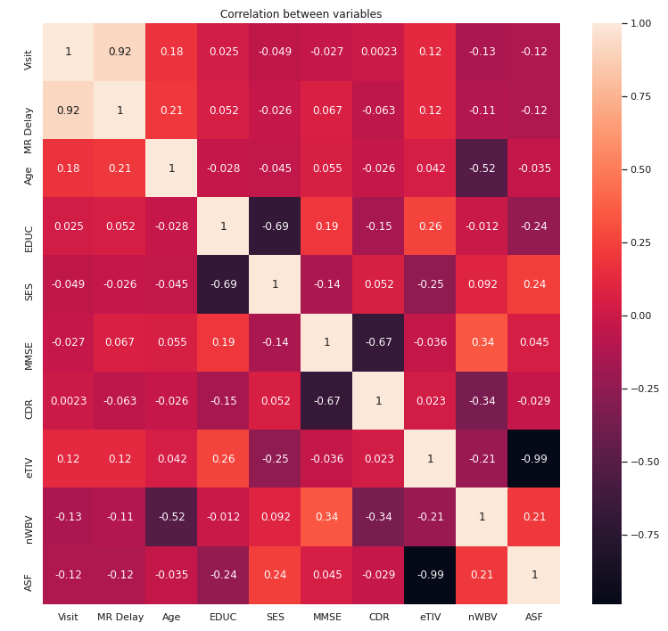

## Detection of Dementia using Machine Learning techniques

### What is Dementia ?
A general term for loss of memory, language, problem-solving and other thinking abilities that are severe enough to interfere with daily life. 
**Alzheimer’s** is the most common cause of dementia.

### Detection of Dementia
Patients suffering from Dementia have shrinkage of brain tissues and change in their speech patterns. 
Thus dementia can be detected in two major ways:
- Speech Patterns
- MRI Images

The current treatment cannot stop the disease but rather slow down the damage caused.
Detecting at early stage can reduce damage to large extent.

### Using MRI Images
MRI images of Alzheimer Disease(AD) patients show both local and generalized shrinkage of brain tissues. There are various other factors like age,education and socioeconomic status that determines the course of the disease.
We use Machine Learning techniques to detect dementia even at mild damage so that immediate treatment can be given.

### Dataset
- We used MRI related dataset from Open Access Series of Imaging Studies (OASIS)
- It is longitudinal MRI data consisting of 150 people aged between 60 to 96.
- Everyone is right handed.
- Some patients were under NonDemented category at first visit but later on were found Demented. These fall under category Converted.

#### Column Description

| Column Name | Description |
| --- | ----------- |
| EDUC | Years of education |
| SES | Socioeconomic Status |
| MMSE | Mini Mental State Examination |
| CDR | Clinical Dementia Rating |
| eTIV | Estimated Total Intracranial Volume |
| nWBV | Normalized Whole Brain Volume |
| ASF | Atlas Scaling Factor

### Correlation between Variables

### Dementia and Gender

| Category | M | F |
| --------- | ----- | ------ |
| Demented | 40 | 38 |
| Non-Demented | 22 | 50 |

More number of males have dementia than females.

### Dementia and MSSE (Mini Mental State Examination)

Nondemented has higher test result ranging from 25 to 30.

### Dementia and nWBV (Normalized Whole Brain Volume)

Nondemented group has higher brain volume than Demented group. This is true  because the disease causes the shrinking brain tissue.

### Dementia and Age

- There is a higher concentration of 70-80 years old in the Demented patient group than the Nondemented group.
- We guess patients who suffered from the disease have lower survival rate and hence there are very few over 90 years old.

### Clinical Dementia Rating (CDR)

Relation between variables and CDR (Clinical Dementia Rating) :
- While the Dementia/Non-Dementia classification had relation with age and gender, this direct connection is not found with CDR.
- No obvious connection between Education Level/Socio Economic Status and CDR as well.
- While the MMS examination results of objects not diagnosed with Dementia concentrate near 27-30 point rate, MMSE results of objects diagnosed with Dementia seems to be more spreaded. The objects had the highest MMSE score but still have Clinical Dementia Rating of 0.5 or 1. No obvious connection between Estimated total intracranial volume and Dementia Diagnosis.
- Normalized whole-brain volume seems to be more spreaded for objects with CDR = 0 and narrows as CDR grows up. No obvious connection between Atlas scaling factor and Dementia Diagnosis.

### Machine Learning Models

### Random Forest
- It is an ensemble learning method that constructs multiple decision trees and outputs the class that is the mode of the classes or mean/average prediction of the individual trees.
- Classifying Dementia vs Non-Dementia prediction using random forest classifier.

### Support Vector Machine (SVM)
- Support Vector Machine or SVM is a supervised machine learning model which can solve linear as well as non-linear problems.
- Classifying Dementia vs Non-Dementia prediction using support vector machine(SVM), Nondemented = 0,Demented = 1

### XG Boost
- XGBOOST is a decision tree based  ensemble machine learning model.
- It uses gradient boosting framework.
- Classifying Dementia vs Non-Dementia prediction using XGB Classifier, Nondemented = 0,Demented = 1

### Results
- An ROC curve (receiver operating characteristic curve) is a graph showing the performance of a classification model at all classification thresholds. This curve plots 2 parameters: True Positive Rate & False Positive Rate.
- Area under ROC curve (AUC) is between 0.5 to 1, 1 being best classifier.
- We plot AUC for all three models to see difference between them.

- Following graph shows relative feature importance in classification of Demented vs Non-Demented.

- We observe that MMSE is the most important feature whereas gender and socio economic status are least important features.

### Classifying CDR
- Instead of binary classification between Dementia and Non-Dementia we can classify into CDR classes which will give the severity of dementia.
- Classification model classifies CDR into 0,0.5 and 1 where:
0: Non Dementia	0.5: Mild Dementia	1: Severe Dementia
- We use the classification based models: random forest, support vector machine (SVM) and XGBOOST to classify CDR.
- We observe accuracy of 80% in case of SVM and accuracies of 73% and 78% in random forst and XGBOOST respectively.
- Following graph shows relative feature importance in classification of CDR.

- Similar to Dementia vs Non Dementia classification, we observe that MMSE is the most important feature whereas gender and socio economic status are least important features.

### Future Scope
- Only MRI images has been used here to detect Dementia. The current work can be extended by inculcating speech patterns. A combined model can be created which uses both MRI images and speech patterns to detect Dementia and it's severity which can give more accurate results.

- Deep learning techniques couldn't be incorporated due to fewer data points. In case of availability of more data deep learning can be used.

